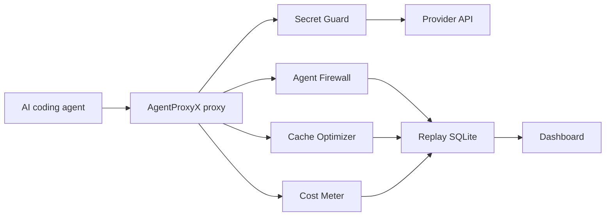

# Architecture

AgentProxyX is split into small, auditable modules:

- `cli`: command-line entry point.
- `agents`: presets for supported coding agents.
- `proxy`: local HTTP gateway and provider forwarding.
- `secrets`: outbound secret detection and redaction.
- `firewall`: tool-command and file-access policy checks.
- `cost`: approximate token and prompt-cache savings meter.
- `replay`: SQLite event store used by the dashboard.
- `dashboard`: local HTML timeline UI.

The first release avoids heavyweight dependencies. This keeps installation simple and makes the security-sensitive code easy to inspect.

